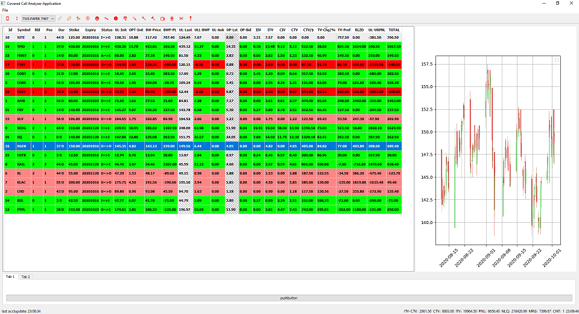
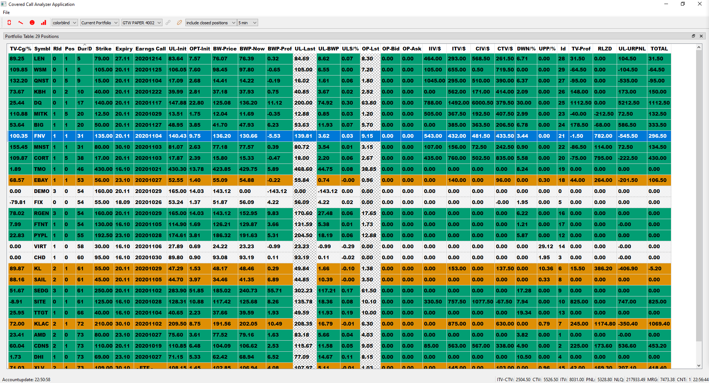
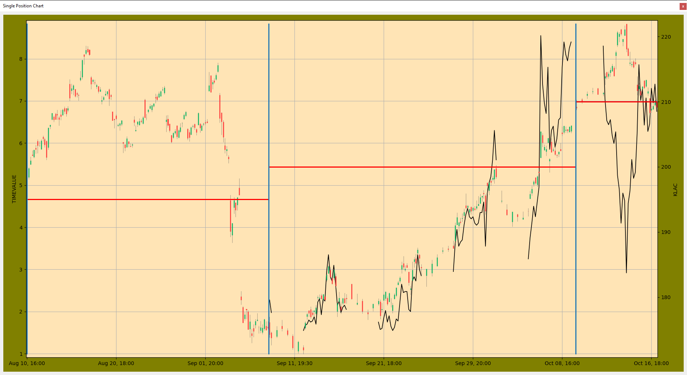

# ibpy - Covered Call Position Manager 

Visualize and track status, timevalue and volatility of all positions of a covered-callportfolio. 

## Intro
This tool serves as a helper when implementing a covered-call-strategy as promoted by the "Blue Collar Investor" [BCI], promoted by Alan Ellman (https://www.thebluecollarinvestor.com/) and his teammembers.
The mentioned strategy provides guidelines and rules to manage Positionentries, -exits, -rollovers and Stock- and Option Selection by a set of rules. Furthermore there are special addon services for so-called premium members.

## Background
One rule of the BCIstrategy says to rollover the option as soon as the timevalue decreases below 20 or 10% under specific conditions. But when managing portfolios consisting of more than 10 or 15 positions this begins to get difficult. Furthermore it is more and more difficult to track earning dates, dividend dates andso on if you  manage more than 10 positions. This tool shouldhelp out by visualizing these most important data.

## Functionality
IBPY helps in calculating your profit and loss for the covered call portfolio. It logs each and every activity (logbook functionality).So lateron you are able to reproduce each and every step to verify/measure and improve your successful trading activities in this context. Besides doing calculations: it does NOT automate any trading activities ! At least not at the moment.

### Both Widget in docked state

### Undocked Table Widget

### Undocked Chart Widget

So the main pupose of having this tool is to get and track how much timevalue is left. This is not provided by the broker but it is the core main information for trading along this BCI strategy if you bring it down to one single item: realizing profits at the right time an in the right position.
Having a basis like this one gets the opportunityfor optimization of almost all aspects of the covered call position management.

## Used Technology, Frameworks and APIs
This small tool consists of a table with the most important column "TV Change/%" to track how much timevalue has been lost until now (tracked  in realtime if connected to IBKR). 
Used Technologies:

- Python3
- Interactive Brokers API Framework for Python
- PyQT5 Framework
- Matploblib library
- Option Calculator Framework ( https://github.com/YuChenAmberLu/Options-Calculator )

It was tried to design along the MVC Pattern as good as possible.

## Next Steps
- stabilizing (for some reason the app crashes sporadically rarely when connecting to ibkr)
- better visualization with matplotlib: Prio 1 would be visualize the timevalue and/or IV over time
- calculate the IV with the help of Black and Scholes and compare with real volatility
- show the best rollover candidates as soon as timevalue has decreases enough
- implement reminder for earningscall dates, dividend dates, expiry dates

If somebody is interested to help out you are welcome to contact me to talk  about the possibilities.
