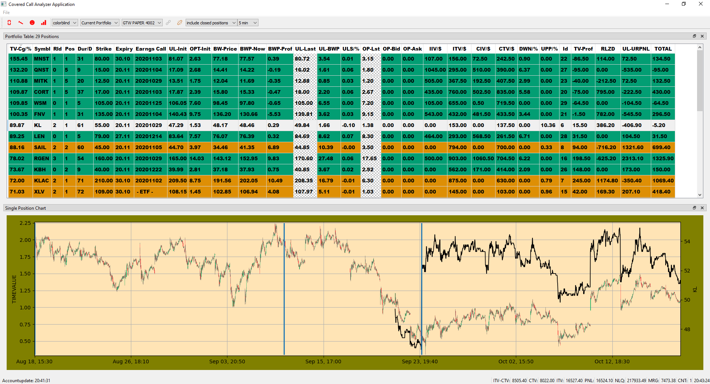

# ibpy - portfoliomanager-tool for covered call positions working with IB API

Visualize the status and track as closely as possible the timevalue and impied volatility of options as part of a pure covered callportfolio. The portfolioshould be managed according  to the rules of the BLue Collar Investor (promoted by Alan Ellman, see https://www.thebluecollarinvestor.com/)

Currently this tool consists mainly of one big table with the most important column "TV Change/%" to track how much timevalue has been lost already. One rule of the BCIstrategy says to rllover the option assoon as the timevalue decreases below 20 or 10%. When having a portfolio  consisting of more than 10 positions this begins to get difficult. Furthermore it is more and more difficult to track earning dates, dividend dates andso on if you  manage more than 10 positions. This tool shouldhelp out by visualizing these most important data.

